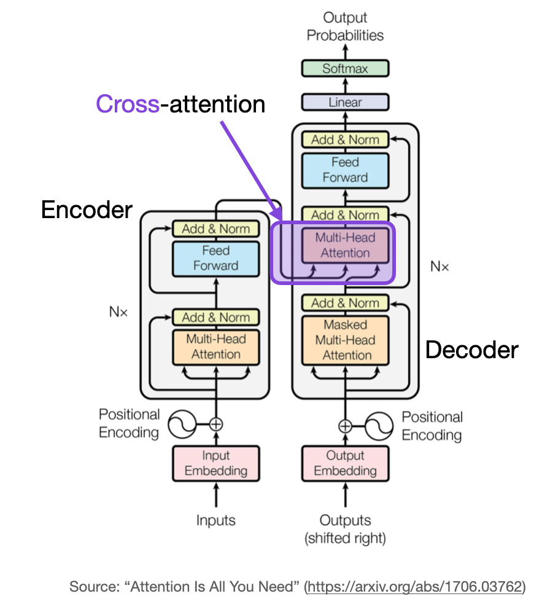

# Cross-Attention

Cross-attention (or Encoder-Decoder Attention) relates positions from two different sequences.

## 🖼️ Diagram

## 📄 Original Paper
- **Title:** [Attention Is All You Need](https://arxiv.org/abs/1706.03762)
- **Year:** 2017
- **Authors:** Vaswani et al.

## 💡 Key Concept
Unlike self-attention, cross-attention uses Queries from one sequence (usually the target/decoder) and Keys and Values from another sequence (usually the source/encoder). This is fundamental for tasks like machine translation.
